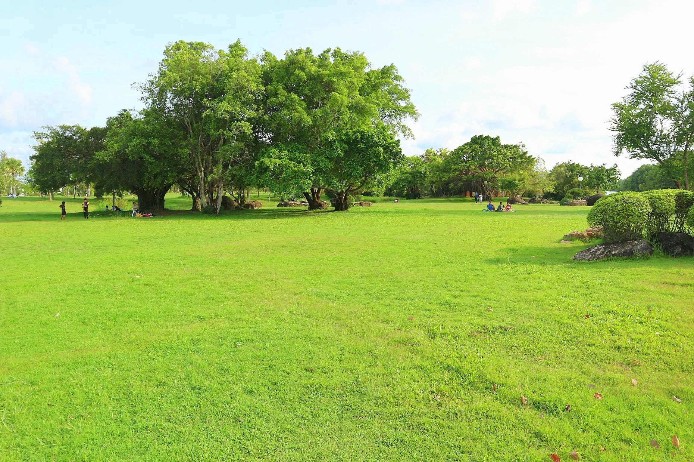

# S<!DOCTYPE html>
<html>
<title>W3.CSS Template</title>
<meta charset="UTF-8">
<meta name="viewport" content="width=device-width, initial-scale=1">
<link rel="stylesheet" href="https://www.w3schools.com/w3css/4/w3.css">

<body>

<!-- Navbar (sit on top) -->

  

    <a href="#home" class="w3-bar-item w3-button">Songkhla Go Go</a>
    <!-- Right-sided navbar links. Hide them on small screens -->
    

      <a href="#about" class="w3-bar-item w3-button">About</a>
      <a href="#menu" class="w3-bar-item w3-button">Menu</a>
      <a href="#contact" class="w3-bar-item w3-button">Contact</a>
    

  

<!-- Header -->
<header class="w3-display-container w3-content w3-wide" style="max-width:1600px;min-width:500px" id="home">
  
  

  

</header>

<!-- Page content -->

  <!-- About Section -->
  

    

     
     

   

    

      <h1 class="w3-center">�Ѵ��������ʹ</h1> 
      <h5 class="w3-center">����ѵԤ���������</h5>
      
����������� ��������ʹ �ӹҹ����ç���������ҷ�Ѿ�� ʧ��� 
����������� ��ҧ�ҡ�Ҵ�����һ���ҳ 3 �������� ��������鹷ҧ��ʶҺѹ��������§�ѵ����Ӫ�½�����觪ҵ� 
�յӹҹ���Ҷ֧����������� ���ͷ�����¡�ѹ�����Ҿ������ͧ��� ���ǹҧ�ç� ��� ����駹�鹷ҧ���ͧ�����ո����Ҫ��˹���èؾ�к�������ԡ�ҵ���਴��� ��ШѴ�ҹ�������ͧ�˭��� ��ô� 12 ������ͧ�ѡ�������ҧ������Թ�ͧ仺�è�㹾�к���ҵ� ���ͧ�������ç�����������ͧ���������ͧ��鹹����ո����Ҫ���� ��Сͺ�Ѻ����ç�դ�����ѷ��㹾ط���ʹ� �֧����Թ�ͧ��繨ӹǹ�ҡ�֧�����ʹ��÷ء��������� ����������������͡��Թ�ҧ�����ͧ�����ո����Ҫ ��С��ѧ��Թ�ҧ��������Ҷ١����������ش �֧���Ҩʹ���ͷ����½����Ҵ��������˹��� ����ͫ����������  �������Һ������ҷҧ���ͧ�����ո����Ҫ�����èؾ�к�������ԡ�ҵ���������� ����ç�������ҡ �֧��������Ţ���Թ�ͧ��è���麹�ʹ����١˹��� ��������١���͵Ѵ��Ǣͧ�����ҧ�������ʹ��� ����ç�����㨵�� �١���͵�ͧ��㨵Ѵ������ҹ�����ҧ��麹�ʹ��ҵ�������� ����١��������ѧ���¡��� ���������ʹ� ���¡����¹������ �������駔 ��͹�Թ����Դ�Ѻ���ʹ������¡��ғ��ǹ���ç� ��Ǻ�ҹ�������Ҵǧ�ԭ�ҹ�ͧ����ç�ѧ��繻��������ҷ�Ѿ���Ҩ��ء�ѹ���� seasonal ingredients.

      
Excepteur sint occaecat cupidatat non proident, sunt in culpa qui officia deserunt mollit anim id est laborum consectetur adipiscing elit, sed do eiusmod temporincididunt ut labore et dolore magna aliqua. Ut enim ad minim veniam, quis nostrud exercitation ullamco laboris nisi ut aliquip ex ea commodo consequat.

    

  

  

  <!-- Menu Section -->
  

    

      <h1 class="w3-center w3-card-2">Our Menu</h1> 
      <h4>Bread Basket</h4>
      
Assortment of fresh baked fruit breads and muffins 5.50
 

      <h4>Honey Almond Granola with Fruits</h4>
      
Natural cereal of honey toasted oats, raisins, almonds and dates 7.00
 

      <h4>Belgian Waffle</h4>
      
Vanilla flavored batter with malted flour 7.50
 

      <h4>Scrambled eggs</h4>
      
Scrambled eggs, roasted red pepper and garlic, with green onions 7.50
 

      <h4>Blueberry Pancakes</h4>
      
With syrup, butter and lots of berries 8.50

    

    

      
       
      
    

  

<h1 class="w3-center w3-card-2">Our Menu</h1> 
 
 
 
 
 

 
 

<!-- End page content -->

</body>
</html>
